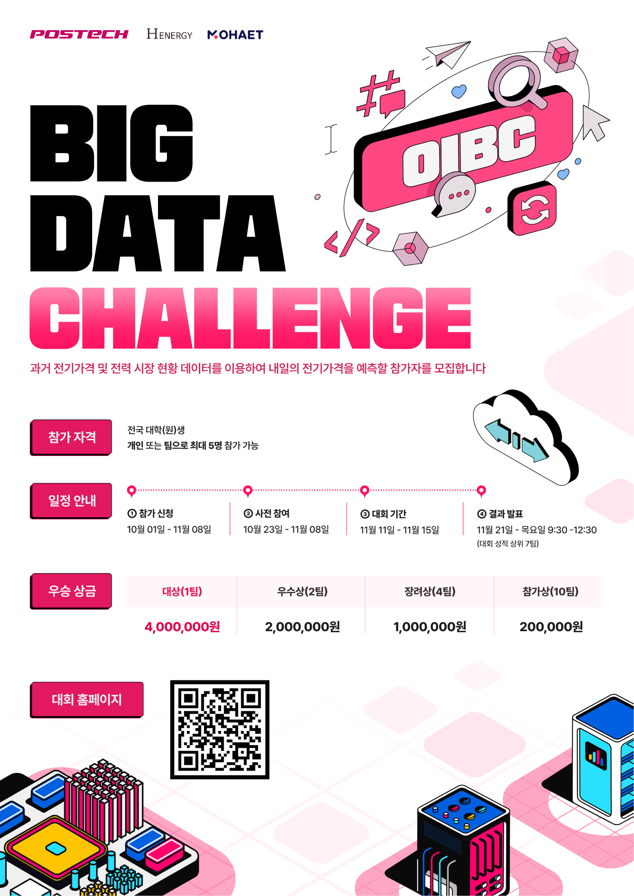
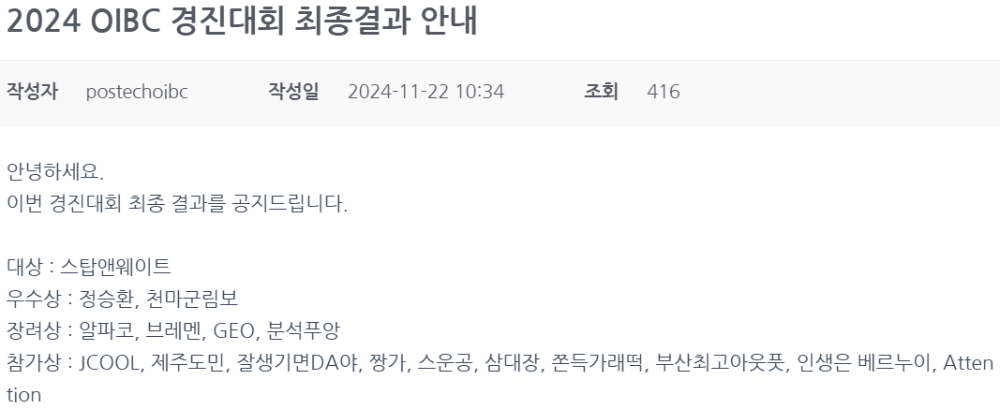

# 2024_POSTECH_OIBC_CHALLENGE

---
## 📌 프로젝트 소개  
2024 POSTECH OIBC CHALLENGE 전력 가격 예측 솔루션  
제주 전력시장 날씨 및 시장 데이터를 활용해 RandomForest와 SVR 앙상블 모델로 하루 전(day-ahead) 전기 가격 예측

---

## 👥 팀 구성

- 팀명: **쫀득가래떡**
- 윤명세 (동의대학교 인공지능학과 3학년)  
- 황언종 (부산대학교 의생명융합공학부 데이터사이언스전공 3학년)  

*모든 작업을 공동으로 수행*

---

## ⚙️ 기술 스택 및 사용 라이브러리

| 구분           | 도구 및 라이브러리                                                                             |
|----------------|----------------------------------------------------------------------------------------------|
| 프로그래밍 언어 |  Python |
| 데이터 처리    |   pandas, numpy |
| 시각화         |   matplotlib, seaborn |
| 머신러닝       |  RandomForest Regressor, SVR |
| 하이퍼파라미터 |  Optuna |

---

## 📂 데이터 설명

- 기상 실측 및 예측 데이터  
- 제주 전력시장 실시간 및 하루 전 시장 전기 가격 데이터  
- 발전량, 수요량 등 추가 관련 데이터

---

## 🔍 데이터 전처리 및 통합

1. **데이터 수집 및 적재**  
- API를 통한 자동 수집 및 CSV 병합으로 최신 데이터 유지  

2. **데이터 정제**  
- UNIX timestamp(Int64)로 시간 통일  
- 결측치 보간 및 삭제  
- 불필요 변수 및 중복, 이상치 제거  

3. **리샘플링 및 병합**  
- 기상 데이터(5분/15분)와 SMP 데이터 1시간 단위 평균 리샘플링  
- 두 지점의 기상 데이터 통합(평균값)  
- SMP, 기상 실측, 예측 데이터를 ts 기준 left join  

4. **파생 변수 및 Feature Engineering**  
- ts → datetime 변환(Asia/Seoul), 시간, 월, 요일 등 추출  
- 시간 주기성 반영: hour_sin = sin(2π × hour/24)  
- 요일, 주말, 공휴일 더미 변수 생성  
- 결측치 추가 보간  
- 불필요 컬럼 제거

---

## 🧪 모델 학습 및 평가

- RandomForest로 기본 예측 후 SVR로 잔차 보정하는 앙상블 모델 적용  
- Optuna 베이지안 최적화로 하이퍼파라미터 튜닝  
- 시간 분할 검증 및 커스텀 평가 지표 활용

---

## 🔬 여러 모델 실험 및 선택

- LightGBM, XGBoost 등 부스팅 계열 모델 실험  
- 딥러닝 모델 시도했으나 데이터 부족으로 인한 학습 실패 발생  

---
## 📊 프로젝트 워크플로우

- 데이터 수집 및 적재  
  ↓  
- 데이터 정제 및 통합  
  ↓  
- 리샘플링 및 병합  
  ↓  
- 파생 변수 생성 및 Feature Engineering  
  ↓  
- 모델 학습 및 앙상블 적용  
  ↓  
- 모델 평가 및 검증  
  ↓  
- 결과 분석 및 개선

---
🏆 수상 내역  
- 200여 팀 중 14위, 참가상 수상 (상금 200,000원)  
- 상위 17팀만 수상, 참가상은 10위~17위 대상  
- 아래 이미지에는 팀들이 **최종 순위 기준으로 정렬**되어 있음  

  
  

 

---

## 📖 결론

약 200개 팀 중 14위 달성으로 상위 10% 근접 성과 달성  
제주 전력시장 하루 전 전기 가격 예측에 대한 이해와 경험 확보

---
## 👥 기여자

| 이름       | GitHub 아이디       | 프로필 |
|------------|---------------------|---------|
| 윤명세     | [myoungse](https://github.com/myoungse) |  |
| 황언종     | [eonjong0218](https://github.com/eonjong0218) |  |
